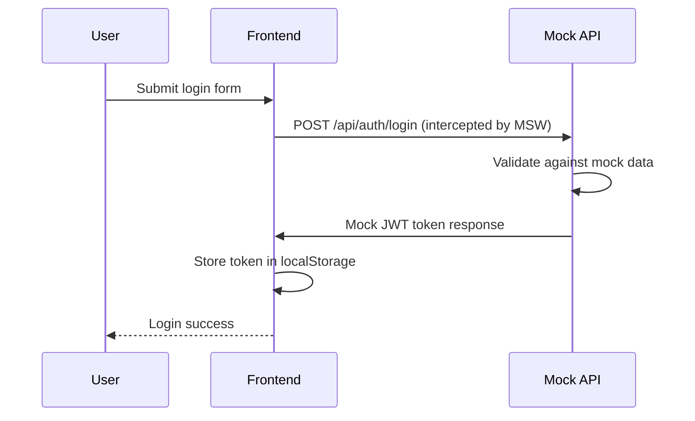
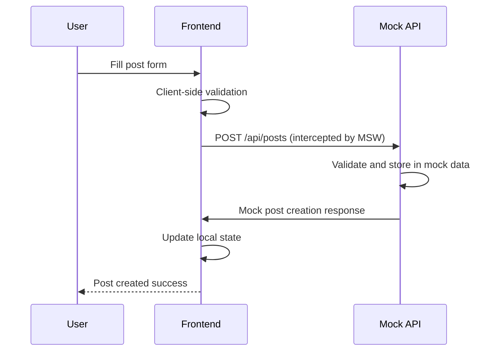
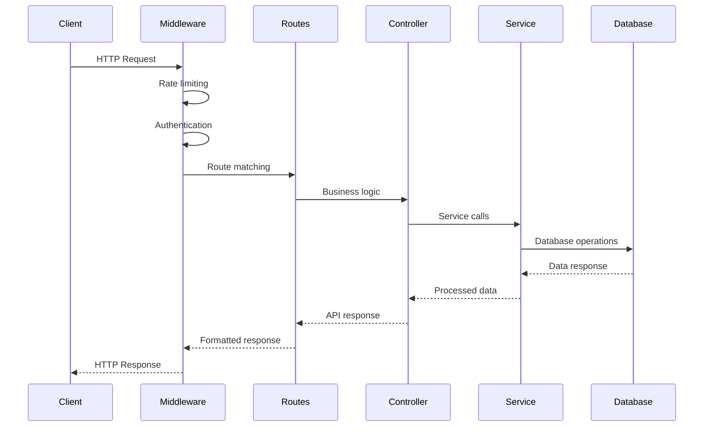

# System Architecture and Design Decisions

## Overview

College Media is a modern frontend-only social media platform designed for educational institutions, built with React and modern web technologies to provide an intuitive and visually appealing experience for students, faculty, and staff. The application uses comprehensive mock data services for development and demonstration purposes.

### Core Components

- **Frontend**: React 19 application with modern UI components
- **Mock Data Services**: MSW (Mock Service Worker) for API simulation
- **State Management**: React hooks and context for local state
- **Styling**: Tailwind CSS with custom gradient themes
- **Build Tool**: Vite for fast development and optimized production builds
- **Testing**: Jest and React Testing Library for unit and integration tests

## Component Architecture

### Frontend Architecture

```
src/
├── components/          # Reusable UI components
│   ├── common/         # Generic components (Button, Input, etc.)
│   ├── layout/         # Layout components (Navbar, Sidebar)
│   ├── posts/          # Post-related components
│   └── users/          # User profile components
├── pages/              # Route-level components
│   ├── Home.jsx
│   ├── Profile.jsx
│   ├── SearchResults.jsx
│   └── AdminDashboard.jsx
├── hooks/              # Custom React hooks
│   ├── useAuth.js
│   ├── usePosts.js
│   └── useNotifications.js
├── context/            # React context providers
│   ├── AuthContext.jsx
│   ├── NotificationContext.jsx
│   └── ThemeContext.jsx
├── services/           # API service layer
│   ├── api.js
│   ├── authService.js
│   └── postService.js
├── utils/              # Utility functions
│   ├── formatters.js
│   ├── validators.js
│   └── constants.js
└── styles/             # Global styles and Tailwind config
```

### Mock Data & Services

```
src/
├── __mocks__/         # Mock data and API handlers
│   ├── handlers.js    # MSW request handlers
│   └── data/          # Static mock data files
├── services/          # Client-side service layer
│   ├── api.js         # API service functions
│   ├── mockApi.js     # Mock API implementations
│   └── localStorage.js # Local storage utilities
└── utils/             # Utility functions
    ├── formatters.js
    ├── validators.js
    └── constants.js
```

## Data Flow Diagrams

### User Authentication Flow



### Post Creation Flow



### API Request Flow



## Mock Data Structure

### User Data Structure
```javascript
{
  id: String,
  username: String,
  email: String,
  firstName: String,
  lastName: String,
  profilePicture: String,
  bio: String,
  role: String, // 'user', 'moderator', 'admin'
  isActive: Boolean,
  isVerified: Boolean,
  followers: Array<String>, // User IDs
  following: Array<String>, // User IDs
  createdAt: Date,
  updatedAt: Date
}
```

### Post Data Structure
```javascript
{
  id: String,
  authorId: String,
  content: String,
  media: Array<{
    type: String, // 'image', 'video'
    url: String,
    thumbnail: String
  }>,
  likes: Array<String>, // User IDs
  comments: Array<{
    id: String,
    authorId: String,
    content: String,
    createdAt: Date
  }>,
  tags: Array<String>,
  visibility: String, // 'public', 'friends', 'private'
  createdAt: Date,
  updatedAt: Date
}
```

## Frontend Design Principles

### Component Design
- Modular and reusable components
- Consistent prop interfaces
- Proper separation of concerns
- Accessibility-first approach

### State Management
- Local component state for UI concerns
- Context API for shared application state
- Custom hooks for complex state logic
- Immutable state updates

### Performance Optimization
- Code splitting with dynamic imports
- Lazy loading of components and images
- Memoization of expensive computations
- Efficient re-rendering with React.memo

### Error Handling
- Graceful error boundaries
- User-friendly error messages
- Logging for debugging
- Fallback UI states

## Security Architecture

### Authentication & Authorization
- **JWT Tokens**: HS256 algorithm with strong secrets
- **Token Expiration**: Access (15min), Refresh (7 days)
- **Password Security**: bcrypt with 12 salt rounds
- **Brute Force Protection**: Progressive delays, account lockout
- **Session Management**: Single active session per user

### API Security
- **Rate Limiting**: 100 requests/minute per IP
- **CORS**: Configured for allowed origins
- **Input Validation**: All inputs validated and sanitized
- **SQL Injection Protection**: Parameterized queries (MongoDB)
- **XSS Protection**: Input sanitization and CSP headers

### Data Protection
- **Encryption at Rest**:
  - Database: Sensitive fields encrypted with AES-256
  - Files: AWS S3 server-side encryption
  - Keys: Managed through AWS KMS
- **Encryption in Transit**:
  - HTTPS: All communications use TLS 1.3
  - Certificate: Valid SSL certificates required
  - HSTS: HTTP Strict Transport Security enabled

### Security Monitoring
- **Logging**:
  - Authentication Events: Login attempts, failures
  - API Access: Rate limit violations, suspicious patterns
  - Data Access: Sensitive data access logging
- **Alerts**:
  - Failed Login Attempts: Threshold-based alerts
  - Rate Limit Violations: Automatic blocking
  - Security Incidents: Immediate notification

## Performance Optimization

### Frontend Performance
- **Code Splitting**: Dynamic imports for route-based splitting
- **Lazy Loading**: Components and images loaded on demand
- **Bundle Optimization**: Vite's tree shaking and minification
- **Caching Strategies**: Browser caching for static assets

### Monitoring & Metrics
- **Application Metrics**: Component render times, bundle sizes
- **User Experience**: Loading states, error boundaries
- **Performance Budgets**: Bundle size limits and performance thresholds
- **Development Tools**: React DevTools and performance profiling

## Technology Choices Rationale

### Frontend: React 19
- **Modern Framework**: Latest React with concurrent features
- **Component-Based**: Reusable and maintainable UI components
- **Ecosystem**: Rich ecosystem of libraries and tools
- **Performance**: Virtual DOM and efficient rendering

### Build Tool: Vite
- **Fast Development**: Instant hot module replacement (HMR)
- **Optimized Production**: Advanced bundling and code splitting
- **Modern Standards**: Native ES modules and TypeScript support
- **Developer Experience**: Rich plugins and configuration options

### Styling: Tailwind CSS
- **Utility-First**: Rapid UI development with predefined classes
- **Responsive Design**: Mobile-first responsive utilities
- **Customizable**: Easy theme customization and extension
- **Performance**: Purge unused CSS in production builds

### Mock Data: MSW (Mock Service Worker)
- **Realistic Simulation**: Intercept and mock network requests
- **Development Focused**: Seamless API simulation without backend
- **Testing Support**: Consistent data for unit and integration tests
- **Service Worker Based**: Runs in the browser for realistic behavior

### State Management: React Hooks & Context
- **Built-in Solutions**: No external dependencies for simple state
- **Local State**: Component-level state with useState
- **Shared State**: Application-wide state with Context API
- **Custom Hooks**: Reusable stateful logic across components

## Deployment Architecture

### Development Environment
- Local development with hot reloading
- Docker containers for consistent environments
- Local MongoDB and Redis instances

### Production Environment
- Containerized deployment with Docker
- Orchestrated with Kubernetes
- Load balanced with AWS ALB
- Monitored with CloudWatch

### CI/CD Pipeline
- Automated testing on pull requests
- Code quality checks with ESLint
- Security scanning with dependency checks
- Automated deployment to staging/production

## Future Considerations

### Enhanced Mock Data
- Expand mock data scenarios for comprehensive testing
- Implement data persistence in localStorage/indexedDB
- Add more realistic API response delays and errors

### Progressive Web App (PWA)
- Service worker implementation for offline functionality
- App manifest for installable web app experience
- Push notifications and background sync

### Advanced Frontend Features
- Real-time features with WebSockets (if backend is added)
- Advanced state management with Zustand or Redux Toolkit
- Component library extraction for reusability

### Performance Enhancements
- Implement virtual scrolling for large lists
- Advanced code splitting and lazy loading strategies
- Bundle analysis and optimization tools

This documentation provides a comprehensive overview of the College Media system architecture and serves as a guide for developers, maintainers, and stakeholders to understand the system's design and make informed decisions about future development.